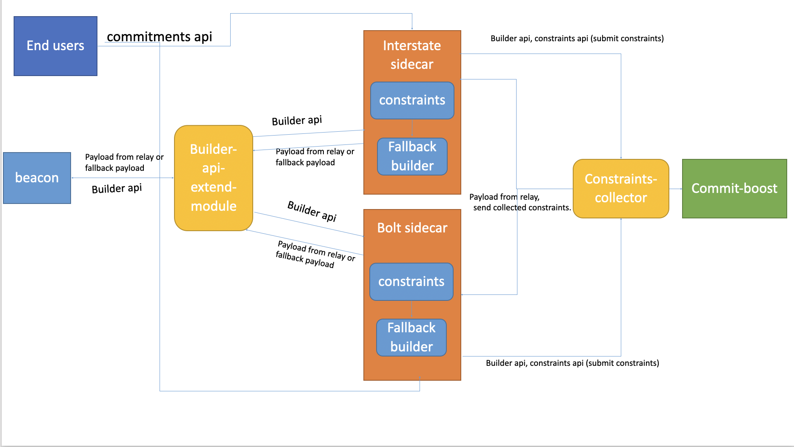

# Interstate sidecar to send preconfirmation requests to commit-boost.


Interstate's design allows multiple preconfirmations to run on the same sidecar. This design promotes decentralization: https://docs.interstate.so/research/multiparty-preconf. 

## How to install
`
git clone https://github.com/interstate-labs/proposer-commitment-network.git
cd proposer-commitment-network
`

## Using cargo
`
cargo build
cargo run
`

## Using docker
`
docker build -t whereasjovially/interstate-boost:1.1.0-dev .
docker compose up -d
`

# Preconfirmation request RPC interface
## Endpoint
`{SIDECAR_URL}/api/v1/preconfirmation`
## Method
`Post`
## Headers
`Content-Type:application/json`
## Body
```
{
  tx: signed raw transaction,
  slot: target slot number,
  sender: signer address
}
```
## Response
`ok:true`