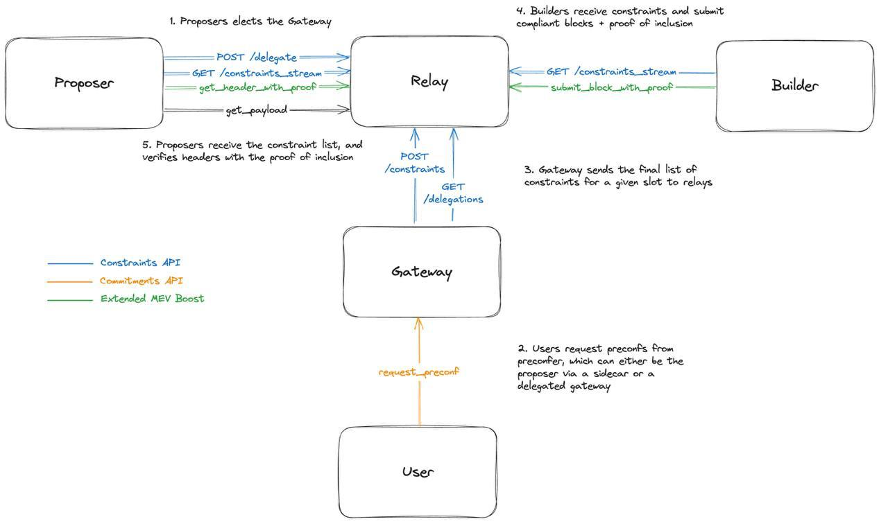

)

# Interstate Sidecar To Enable Continous Transaction Execution on Mainnet.
Interstate is an extension to the PBS / MEV-Boost pipeline which enables instant and continuous transaction confirmations on mainnet, this is a massive UX improvement for Ethereum. 

We follow the common api preconfirmation api spec. Read the full docs at: https://docs.interstate.so

